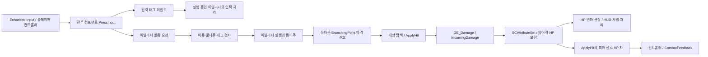

# 07. SoulCombat을 학습용 참고 사례로 읽기

이 프로젝트의 목적은 현재 동작하는 전투 프로토타입을 보고, 비슷한 문제를 스스로 풀 수 있는 근거를 얻는 것이다. 현재 코드를 암기하거나 모든 개선 항목을 먼저 구현할 필요는 없다. 2026-09-30 사용자가 밝힌 학습 목적을 기준으로 정리했다.

**현재 우선순위 보충:** 사용자는 게임 제작을 먼저 진행하고 함께 공부하는 과정은 나중에 하기로 했다. 이 문서는 이후 학습을 위한 참고 자료이며, 입력·콤보 큐 공부를 실제 제작의 선행 작업으로 넣지 않는다. 제작 단계에서는 승인된 기능을 구현·검증·통합하고, 나중에 공부 목적으로 질문할 때 아래 힌트 방식을 사용한다.

## 1. 어떤 자료부터 볼까

| 자료 | 읽는 목적 | 주의점 |
| --- | --- | --- |
| `01-game-spec.md` | 플레이어에게 어떤 결과를 약속했는지 | 코드와 대조할 기준 |
| 실제 BP와 `SCAttributeSet.cpp` | 입력·상태·피해가 실제로 이어지는 경로 | 아래의 한 경로씩 추적 |
| `02-build-plan.md` | 처음 나눈 책임과 에셋 구조 | 제작 후 달라진 세부 사항도 있음 |
| `03-build-log.md`, `04-final-qa.md` | 가설·실패·수정·재검증 과정 | 과거 기록은 당시 상태이며, 04의 후반 수정 결과까지 읽기 |
| `engine-api-notes.md` | 엔진 동작을 확인하는 방법 | 파일·줄 번호는 작성 당시 UE 버전 기준 |
| `mcp-cookbook.md` | 에셋 제작 도구를 사용하는 방법 | MCP의 한계를 UE의 한계로 일반화하지 않기 |
| `05-portfolio-roadmap.md` | 기능을 발전시키는 후보 목록 | 취업용 계획이며 학습 필수 순서가 아님 |
| `08-pc-validation.md` | 변경 전 초기 PC 준비 결과 | 초기 기준cc31c5c와 현재 제작본을 구분 |
| `11-production-validation.md` | 이후 제작 변경·실패 원인·최종 자동 검사와 패키지 | 사람 플레이 검증을 자동 통과로 대신하지 않기 |

README의 전체 에셋을 처음부터 읽기보다, 하나의 행동을 끝까지 추적한다.

## 2. 먼저 따라갈 세 경로

이 그림은 이 프로젝트의 책임 배치를 나타낸다. 모든 GAS 프로젝트가 같은 구조를 써야 한다는 의미는 아니다.

### 입력 한 번이 평타가 되는 과정

- 확인할 곳: `BP_SCPlayerController` → `AC_CombatComponent.PressInput` → `GA_Player_BasicAttack`.
- 관찰할 값: 어빌리티 핸들, `State.Attacking`, `ComboStep`, `QueuedInputs`, `bPastChainPoint`.
- 생각할 문제: 실행 중인 어빌리티의 `TryActivateAbility`가 false여도 다음 콤보 입력은 왜 전달될까?
- 첫 힌트: 발동 요청과 실행 중인 행동에 전달하는 이벤트는 역할이 다르다. `PressInput`에서 두 호출의 순서를 확인한다.
- 작은 실험: 한 번 누르기, 같은 프레임 네 번, 0.35초 간격 네 번의 상태 변화를 시간순으로 적는다. 먼저 예상한 뒤 실행 결과와 비교한다.

### 피해 한 번이 HP를 바꾸는 과정

- 확인할 곳: `FindTargets` → `IsValidTarget` → `ApplyHit` → `GE_Damage` → `SCAttributeSet::PostGameplayEffectExecute`.
- 관찰할 값: 진영 태그, 가드 각도, 공격 계수, `Data.Damage`, `IncomingDamage`, `Defense`, `Health`.
- 작은 계산: 잡몹 공격력 30, 플레이어 방어력 20이면 일반 피격은 25, 정면 가드는 5다. 숫자가 다르면 어떤 단계부터 확인할지 정해 본다.
- 첫 힌트: 대상 선택 실패, 가드 배율 오류, GE 입력 누락, 최종 속성 보정을 분리해 관찰한다. 처음부터 피해 공식을 바꾸지 않는다.

### 행동이 취소될 때 무엇이 남는지

- 확인할 곳: 대시·피격·사망 관련 GA 태그, 어빌리티 종료 경로, `AC_CombatComponent`의 사망·부활 처리.
- 관찰할 값: `State.Attacking`, `State.HitStun`, `State.Dashing`, `State.Invulnerable`, `State.Dead`, 활성 GE와 몽타주.
- 생각할 문제: 경직 태그를 GA와 별도 GE가 동시에 소유하면, GA만 취소했을 때 무엇이 남을까?
- 첫 힌트: 상태의 시작 조건보다 해제 책임을 먼저 그려 본다. 정상 완료·대시 취소·사망·레벨 전환 각각을 비교한다.

## 3. 이 사례에서 가져갈 설계와 선택 조건

| 구현 | 배울 점 | 다른 선택을 검토할 때 |
| --- | --- | --- |
| 전투 컴포넌트 공용화 | 캐릭터 종류와 피해 처리 책임 분리 | 역할이 커지면 대상 탐색·입력·피해 책임을 다시 살펴보기 |
| GA 기반 클래스와 데이터 에셋 | 공통 실행 흐름과 개별 설정 분리 | 상속만으로 표현하기 어려운 차이가 생길 때 조합 검토 |
| 태그로 발동·취소 제어 | 상태 규칙을 여러 행동에 공용으로 적용 | 태그 소유자·유효 기간·해제 경로가 불명확해질 때 |
| 컨트롤러를 통한 UI 호출 | 게임 쪽 코드가 위젯 내부 구조를 몰라도 됨 | 플레이어가 여러 명이거나 UI 수명 관리가 복잡해질 때 |
| 방 부모/자식 BP | 방 시작·종료와 방별 규칙 분리 | 웨이브·이벤트 조건을 데이터로 조립하고 싶을 때 |
| `IncomingDamage` 메타 속성 | 입력 피해와 실제 HP 변경을 구분 | 공격/방어 속성을 포착하고 복잡한 계산을 재사용할 때 |

`PostGameplayEffectExecute`에서 HP와 메타 속성을 처리하는 것은 공식 문서에서도 다루는 방식이다. ExecutionCalculation은 계산 책임을 모듈로 분리하는 선택지다. 단순 싱글 플레이 공식을 이 콜백에 둔 것만으로 잘못된 설계라고 판정하지 않는다. [Epic 속성·AttributeSet 문서](https://dev.epicgames.com/documentation/unreal-engine/gameplay-attributes-and-attribute-sets-for-the-gameplay-ability-system-in-unreal-engine), [GAS 구성 설명](https://dev.epicgames.com/documentation/unreal-engine/understanding-the-unreal-engine-gameplay-ability-system)

## 4. 그대로 일반화하면 곤란한 부분

- **타격 시점과 시간 기준:** 초기 WaitDelay 타격은 개별 배속에서 몽타주보다 먼저 실행되는 문제가 있었다. 현재 타격·콤보 신호는 전용 몽타주의 BranchingPoint 이벤트로 전환했다. 종료 대기 등 다른 WaitDelay까지 모두 제거한 것은 아니다. 학습할 때는 이벤트 출처·단계·한 번 소비·취소 뒤 정리를 살펴보고, 애니메이션·액터·월드·실시간 중 각 작업이 따라갈 기준을 먼저 정한다. 실제 보정과 배속·취소 검사 근거는 `11-production-validation.md`에 있다.
- **SetByCaller 비용 공용화:** 피해 Spec에 값을 넣는 방식과 어빌리티의 기본 비용 검사는 다르다. 로컬 UE 5.8.3의 `CheckCost`는 별도 Spec으로 가산 비용을 검사한다. 공용 GE로 바꾸기 전에 SP 부족 시 발동 거부, 정확한 차감, 쿨다운 시작 여부를 어떻게 보장할지 설계한다.
- **MCP 클래스 참조 제약:** 제작 당시 MCP가 BP 클래스 참조 변수를 만들지 못한 것이며, BP 자체가 클래스 참조를 지원하지 않는다는 뜻은 아니다.
- **타이머 기반 직진 AI:** 현재 단순 필드에 맞춘 구현이다. 장애물이 생겼을 때 경로 탐색, 행동 선택, 이동 실행 중 어떤 책임이 필요한지 나눠 본다.
- **싱글 플레이 GAS:** 이 사례는 네트워크 권한·복제·클라이언트 예측을 구현하지 않는다. 같은 BP를 그대로 멀티플레이에 옮겨도 된다고 가정하지 않는다.
- **C++ 양:** C++ 비중을 늘리는 일 자체를 개선으로 간주하지 않는다. 언어 학습, 테스트 가능성, 재사용, 네트워크 요구 중 무엇을 해결할지 먼저 정한다.
- **도구 때문에 생긴 우회:** 클래스 배열, 부모 함수 호출, 주석 생성 등은 엔진 설계 문제와 제작 도구 문제를 구분해 읽는다.

## 5. 개선 방향을 학습 과제로 바꾸기

다음 순서는 권장 학습안이며 구현 승인이 아니다. 한 번에 한 질문과 한 실험만 고른다.

| 순서 | 풀어 볼 문제 | 첫 방향 | 확인할 결과 |
| --- | --- | --- | --- |
| 1 | 평타 입력이 왜 큐에 쌓일까 | 입력 이벤트와 새 발동을 시간축으로 분리 | 빠른 네 번 입력이 정확히 네 타로 끝남 |
| 2 | 애니메이션 속도를 바꾸면 판정도 따라갈까 | 몽타주 시간과 타이머 시간 비교 | 0.5/1/2배속에서 판정 위치와 시점 기록 |
| 3 | 취소해도 판정·연출이 남지 않을까 | 정상 완료와 중단의 정리 책임 확인 | 평타 중 대시·피격·사망 뒤 잔여 상태 없음 |
| 4 | 스킬 한 개의 수치를 어디서 읽을까 | GA·GE·HUD의 중복 수치를 찾아 데이터 원천 결정 | 비용과 표시가 서로 어긋나지 않음 |
| 5 | 적이 벽을 만나면 어떻게 할까 | 경로 탐색과 행동 선택을 분리 | 장애물 전후 행동을 비교 |
| 6 | 한 캐릭터의 설정만 바꿔 재사용할 수 있을까 | 어빌리티 세트와 스탯의 책임 확인 | 공통 로직 수정 없이 차이 표현 |

노티파이·히트스톱은 타이밍과 종료 처리를 이해한 뒤 작은 샘플로 시험한다. StateTree, 스킬 트리, 멀티플레이는 학습 주제에 필요해졌을 때 선택한다. 포트폴리오 로드맵의 기능 개수와 영상 길이를 학습 완료 기준으로 삼지 않는다.

## 6. 이후 도움을 받는 방식

질문에 목표 동작, 현재 시도, 예상과 다른 관찰 결과가 있으면 그 근거부터 함께 본다. 처음에는 원인 후보와 확인 위치를 짚고, 다음에는 작은 실험과 필요한 개념을 제안한다. 더 구체적인 도움이 필요할 때 노드/API 연결과 구현 예시로 내려간다.

예: “평타 중 대시로 끊었는데 0.2초 뒤 피해가 들어가요”라면, 대시의 취소 태그부터 바꾸기 전에 타격 작업이 어느 객체의 수명에 묶였는지, 어빌리티 종료 시 해당 작업이 끝나는지, 이전 입력의 이벤트가 남아 있는지를 확인한다. 아직 실제 원인을 확인하지 않았으므로 어느 하나를 정답으로 단정하지 않는다.

실험은 별도 연습 프로젝트 또는 `_Scratch`에서 한다. 관찰 결과를 남기고 원래 결과와 비교한다. 완성 코드나 직접 수정이 필요하면 그때 요청한 범위에 맞춰 진행한다.
