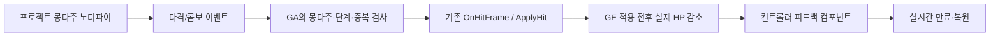

# 09. 게임 제작·완성 계획

최종 Win64 Shipping 빌드와 시작·응답 검사가 통과했고, 구현·자동 검증 기준으로 P1·P2와 P3의 적/보스·회복·던전 흐름, P4 빌드·자동 시작을 완료했다. 최종 난이도·손맛·물리 입력·청취·정상 종료 UI·UE 없는 PC·장기 플레이의 사람 검증은 별도로 남긴다. 현재 결과와 근거는 `11-production-validation.md`에 기록한다.

2026-09-30 사용자가 기존 애니메이션을 유지한 전투 개선과 여러 에디터 병행 방향을 승인하고, 완성까지의 제작 판단·구현·검증을 맡겼다. 이 계획은 현재 전투 필드와 던전 하나를 끝까지 플레이할 수 있는 싱글 플레이 게임을 기준으로 한다. 외부 에셋 구매·권리 동의, 큰 게임 규칙 변경은 선택안을 준비해 사용자에게 확인한다. 직군 결정이나 학습 과정을 선행 조건으로 넣지 않는다.

## 1. 완성 기준과 순서

| 단계 | 제작 결과 | 완료 확인 | 현재 상태 |
| --- | --- | --- | --- |
| P1 전투 판정·피드백 | 프로젝트 전용 몽타주 이벤트, 정확한 콤보/판정, 히트스톱·피격 표현·데미지 숫자·카메라 피드백 | 배속·시간 정지·취소 회귀, 기존 피해/비용/태그, 전체 던전 흐름 | 구현·자동 회귀 완료 |
| P2 스킬·UI | 스킬의 설정과 표시 일치, 조작 안내·상태 표시·플레이 편의 | 스킬별 발동 거부/차감/쿨다운, 위젯 수명·입출력 복귀 | 구현·자동 UI/버튼 회귀 완료 |
| P3 적·보스·전투 공간 | 접근/공격의 안정성, 읽을 수 있는 보스 전조와 페이즈, 방별 진행 | 적 행동·보상·사망/재시작·체크포인트, 정상 게임 루프 | 자연 AI·전조/분노·회복·던전 자동 검증 완료, 난이도·손맛·일반 조작 검증 남음 |
| P4 실행 결과물 | 설정·설명·결과 화면 정리, Win64 Shipping 패키지와 실행 안내 | compile/cook/archive, 시작·응답·검사 프로세스 정리, 남은 사람 검증 명시 | 오류/경고0 빌드·자동 시작 완료, 정상 종료 UI·UE 없는 PC·장기 플레이는 사람 검증 |

불필요한 맵·캐릭터 확대와 멀티플레이 전환은 이번 기본 완성 범위에 넣지 않는다. 기존 평타 50/55/65/100, Q/E/R 150/200/125, 비용과 캔슬 규칙은 먼저 보존한다. 새로운 밸런스가 필요하면 실측과 목표를 기록하고 변경한다.

## 2. P1 책임과 인터페이스

### 판정

- 템플릿 원본 대신 `/Game/SoulCombat` 아래 몽타주 복제본을 사용한다.
- `AN_SCGameplayEvent`는 AnimNotify BP다. 몽타주 트랙의 BranchingPoint에서 `Received_Notify`로 아바타에 게임플레이 이벤트를 보낸다.
- 타격 태그 `Event.Combat.HitFrame`, 콤보 태그 `Event.Combat.Combo.Chain`을 사용한다. Payload의 `OptionalObject`는 이벤트를 낸 Animation, `EventMagnitude`는 평타 단계 1~4다.
- GA는 자신의 몽타주와 단계를 확인하고 단계별 타격을 한 번만 처리한다. `GA_ActionBase.OnHitFrame`을 유지해 대지 강타와 투사체 스킬의 자식 구현을 보존한다.
- 기존 입력 큐 최대3과 3→4타 몽타주 전환의 동기 OnInterrupted 가드는 유지한다. 대시·스킬의 즉시 캔슬을 새 CancelWindow 제한으로 바꾸지 않는다.
- 새로운 신호를 실제 PIE에서 확인한 뒤 타격/콤보용 WaitDelay를 제거한다. 어빌리티 종료는 수신 작업과 남은 판정을 정리해야 한다.

### 명중 피드백

- 새 `AC_CombatFeedback`는 플레이어 컨트롤러에 붙인다. 공개 함수는 `ReportHit(Attacker: Actor, Target: Actor, Damage: float, bGuarded: bool)`다.
- 원본 `AC_CombatComponent.ApplyHit`는 GE 적용 전후 대상 Health를 읽어 `max(0, Before-After)`를 전달한다. Instant GE의 핸들 유효성으로 성공을 판정하지 않는다. 무적/이미 죽은 대상의 감소량0에는 명중 연출을 재생하지 않는다.
- 실제 피해와 가드 여부로 세기를 선택한다. 별도 공격 종류나 모든 호출자의 서명 변경을 먼저 강제하지 않는다.
- 히트스톱 대상의 최초 `CustomTimeDilation`을 보존하고, 컨트롤러 컴포넌트의 정상 Tick와 `GetRealTimeSeconds`로 만료를 관리한다. 재피격은 기존 복원값을 덮어쓰지 않는다. 사망·무효 대상·EndPlay·일시정지 경로에서 복원한다.
- 기본 카메라 FOV와 원래 오버레이 상태도 보존한다. 피드백은 비용·쿨다운·경직의 기존 의미를 임의로 바꾸지 않는다.
- `bEnableHitstop`은 판정 전환을 검증한 뒤 통합 원본의 피드백 에셋 기본값과 PC의 배치 컴포넌트에서 true로 활성화했다. 담당 B 사본의 반환 기본값은 false였으며 통합에서 활성화했다.

## 3. 병행 담당

실제 내부 에이전트는 현재 모델·추론 설정을 상속한다. 아래 모델/추론은 작업 특성에 따른 권장안이며, 실제 설정을 확인한 값은 아니다.

| 담당 | 소유 범위 | 권장 모델 / 추론 | 반환과 검증 |
| --- | --- | --- | --- |
| A 판정 | 노티파이 BP, 프로젝트 몽타주, GA_ActionBase·평타·자식 GA 몽타주 참조 | Astra / ultra. 비동기 이벤트·중단·콤보 경계의 불확실성이 높음 | 실제 branch/SHA·diff, 새 신호와 기존 콤보/비용/취소 결과 |
| B 연출 | 새 피드백 컴포넌트, 플래시 머티리얼, 부유 숫자 위젯/액터 | Sol / high. 확정 인터페이스의 독립 구현·복원 테스트 | 실제 branch/SHA·diff, 반복 피격·무피해·EndPlay 복원 결과 |
| 통합 | 원본 AC_CombatComponent·BP_SCPlayerController·ini·문서·테스트·패키징 | Astra / ultra. 여러 모듈의 상태/수명과 바이너리 통합 | 양쪽 반환 독립 확인, 전체 컴파일·의존성·관련 회귀·Shipping |

- 각 담당은 별도 worktree·프로젝트·포트에서 작업한다. A=8001, B=8002, 통합=8000. 템플릿 콘텐츠와 C++ 모듈은 같은 기준에서 복원한다.
- 같은 에셋은 한 담당만 수정한다. 공통 인터페이스는 통합 담당이 먼저 기록하고, 변경 시 양쪽에 전달한다.
- 에디터 한 개의 MCP와 Python 요청은 순차다. 클립보드/UI·빌드·패키징은 공유 자원을 고려해 조율한다.
- 통합 대상 에디터를 닫거나 에셋을 내린 뒤 실제 변경을 합친다. 작업 사본의 개별 성공과 통합 성공은 따로 판정한다.

## 4. 테스트부터 작성

기존 `Saved/audit-*.json`과 PIE 검사 코드를 기준으로 재사용하되 새 조건은 구현 전에 추가한다. 저장된 실제 에셋과 PIE 월드를 사용하며 모의 데이터는 게임에 넣지 않는다.

- 타격 순간의 실제 몽타주 위치를 기록한다. 개별 배속0.25/0.5/1/1.5와 짧은 히트스톱에서도 몽타주 타격 지점 전에는 피해가 없어야 한다.
- 같은 프레임4/8연타, 0.1/0.35초4연타, 단타, 입력 큐3, 피니시, 대상별1회 피해.
- Q/E/R 피해·비용·쿨다운·SP부족, 투사체 관통/중복 금지.
- 대시·피격·사망·몽타주 중단 후 늦은 판정과 태그 없음. 서로 다른 액터의 이벤트는 섞이지 않음.
- 피해0/가드/과잉피해의 연출, 반복 명중과 EndPlay 후 모든 시간 배율·FOV·오버레이 복원.
- 모든 BP 컴파일, 관련 참조, 기존 필드→게이트→던전→보스→클리어→복귀.

자동 검증은 실제 키·화면·소리의 사람 검증을 대신하지 않는다. 패키지와 함께 사람이 확인할 조작 목록도 제공한다. 완료한 항목만 `docs/checklist.md`에 체크한다.

## 5. 제작 기록

- 시작 기준: `5063dcf`(게임 제작 우선과 병행 지침 반영), 작업 트리 깨끗함.
- 공통 태그·계획 기록 후 그 커밋을 A/B의 동일 기준으로 사용한다. 실제 경로·브랜치·포트와 중간 결과는 이 절에 이어 기록한다.
- 병행 기준은 `81a750f`다. A=`../_workers/combat-timing`/`codex/combat-timing`/8001, B=`../_workers/combat-feedback`/`codex/combat-feedback`/8002, 통합 원본=8000이다. 관리 worktree 도구가 부모 작업 디렉터리를 저장소로 인식하지 못해 실제 저장소에서 Git worktree를 만들었다.
- A 소유 범위에 `GA_Boss_Slam`의 타격 신호와 `GA_Boss_Charge`의 경로 검사 개선을 추가했다. Slam의 타이머도 개별 배속에서 조기 피해가 재현됐다. Charge는 시작/표본/끝점 사이 스윕을 통해 공백을 잇되 기존 HitActors·계수·속도·지속시간을 보존한다. 전조/별도 패턴 확대보다 실제 판정 누락 확인과 수정이 먼저다.
- 통합 담당은 P2 일시정지 메뉴와 현재 맵 처음부터 재시작·필드 복귀·종료를 구현했다. 자동 부활은 현재 방 진행 유지, 메뉴 재시작은 현재 맵 전체 초기화로 안내한다. 코어8·실제 버튼/맵 전환9 검사 통과. 실제 키·화면 확인은 별도다.
- P2 실제 Cost GE와 HUD의 비용/속성, 실제 쿨다운 효과 표시16조건과 방별 사망·자원/체크포인트 복구·진행 유지39조건은 최종 통합 회귀에서도 통과했다.
- 공통 ApplyHit의 함수 로컬 Health 값으로 실제 감소량을 계산해 DispatchCombatHit→PC.ReportCombatHit→AC_CombatFeedback.ReportHit를 연결했다. PC에 피드백 컴포넌트 하나를 배치했고 숫자·가드 표시·플래시·히트스톱·FOV 펄스와 직접 생성·임포트한 명중/가드 효과음2개를 사용한다. 실제 피해0/무적/가드/과잉피해/사망 적과 메뉴 복원17조건 및 원본에서 다시 실행한 피드백 독립57조건이 통과했다.
- 통합 돌진 검사에서 두 중간 옆걸음의 피해0이 발견됐다. HitAlongPath가 스윕 전에 PreviousTraceLocation을 갱신해 순수 Get 노드의 Start가 현재 End와 같아지는 것이 원인이었다. IsValid→스윕→이전 위치 갱신→적중 순회로 실행 연결만 바꿨다. 6개 경로 검사 중3실패를6통과로 보정했고 실제 어빌리티·Root Motion의 적 공격12조건도 통과했다. 기존 수치·히트수·쿨다운·전조·속도·지속시간과 다른 GA는 변경하지 않았다.
- 돌진 수정 뒤 세 번째 최종 통합 실행의11개 묶음178조건은 약203초에 모두 통과했다(`SoulCombat/Saved/integrated-regressions.json`). 별도 스파링 자율 AI17조건도 통과했다. 실제 Think 타이머/Tick을 유지한700cm 진입→접근/공격/피해25→범위 밖 배치/추격 해제→재진입/피해25→사망 대상 추격 해제를 확인했다. 플레이어 이동 고정과 다른 AI 휴면은 PIE 준비 조건이며 장애물 우회·난이도·물리 입력 검증은 아니다.
- 전체 회귀178·돌진 경로6·자율 AI17·피드백 독립57의 합은258개 통과 조건이다. 같은 기능을 다른 조건에서 반복 관찰하므로258개의 서로 다른 시나리오로 표현하지 않는다. 첫 cook 전 BP77개 엄격 재컴파일·에셋116/의존227 존재·Scratch0·dirty 콘텐츠/맵0도 확인했다. 메뉴 정지 화면의 한국어 글자·4개 버튼·안내 배치 확인과 실제 키/마우스·청취·정상 던전 완주·UE 없는 PC·장기 플레이를 구분한다. 현재 통합 근거는 `11-production-validation.md`에 기록한다.
- P4 첫 Win64 Shipping UAT는 코드4c6ee1a에서58.329초·ExitCode0으로 성공했고32파일/727,456,174바이트와 런타임 설치 파일2개를 동봉했다. cook에서9개 BP의 서로 다른 주석 노드25개에 NodeGuid 누락 경고가 나와 최종 배포물로 채택하지 않았다. AddCommentNode의 GUID 생성 누락과 PostLoad의 dirty 표시 없는 메모리 복구를 엔진 소스로 확인했다. 새 에디터에서9개 패키지를 only_if_is_dirty=False로 강제 저장했고64개 그래프·925개 실행 노드의 타입/위치/전체 핀/값/연결 JSON 동일성을 확인했다. 보정 후 전체77개 엄격 컴파일·116/227 집계·누락/Scratch/dirty0도 통과했다. 이 주석 메타데이터 보정은 게임 동작 수정과 구분하며 기존258개 실행 조건의 근거를 유지한다.
- 최종 소스dd559e08481ca1726ed6e1f967eee06de21c185a의 별도 Win64Shipping-20260930-Final 출력은51.797초·ExitCode0으로 빌드했고 cook 오류0·경고0·GUID 경고0을 확인했다.32파일·727,456,174바이트와 런타임 설치 파일2개를 포함한다. 실제 패키지의 부트스트랩→Shipping 자식·창과5~25초의5회 응답을31.029초 검사하고 검사 프로세스를 정리했다. 정상 종료 UI 검증과 구분한다. 전달용ZIP33개 항목의 전체 CRC 검증이 통과했고435,928,098바이트다. 작업 에디터·검사 게임 프로세스와 MCP8000/8001/8002의 잔존 없음도 확인했다. 사람 검증은 별도로 남긴다.
